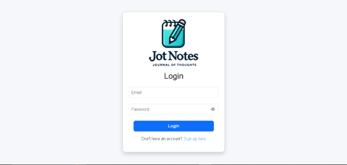
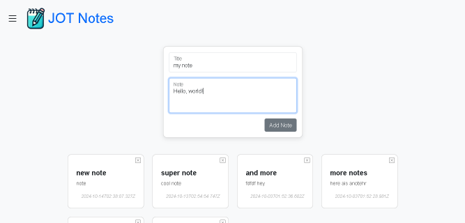
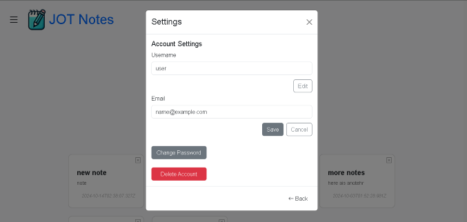

  

# Jot Notes (Journal of Thoughts)

## Description
**Jot Notes** is a handy note-taking tool designed to make capturing thoughts and ideas quick and easy. With a user-friendly interface and essential features, you can effortlessly create, update, and manage your notes.

---

## Table of Contents
1. [Getting Started](#getting-started)  
2. [Usage](#usage)  
3. [License](#license)  
4. [Questions](#questions)  

---

## Getting Started

To get started, visit [Jot Notes](https://jot-notes-j04f.onrender.com) online. No downloads are required.

---

## Usage

1. **Create an Account / Log In**:  
   Start by registering or logging in with your existing account.

2. **Add a Note**:  
   Enter a title and content, then click the **Add** button to save your note.

3. **Update a Note**:  
   Select a note from your list, edit the title or content, and click **Save**.

4. **Delete a Note**:  
   Click the **X** button at the top-right corner of the note to remove it.

### Screenshots:

**Login Screen:**  

**Main Screen:**  

### Settings:
Access the **Settings Menu** from the left sidebar to:  
- Change your username  
- Update your password  
- Delete your account

**Account Settings:**  

---

## License

This project is licensed under the **MIT License**. For more details, see the [license page](https://opensource.org/licenses/MIT).

---

## Questions

If you have any questions or suggestions, feel free to reach out!  

- **GitHub**: [Flem-House-Dev](https://github.com/Flem-House-Dev)  
- **Email**: [flemhousedev@gmail.com](mailto:flemhousedev@gmail.com?subject=JOT%20Notes%20Inquiry)  

We welcome contributions and feedback to improve the app!
